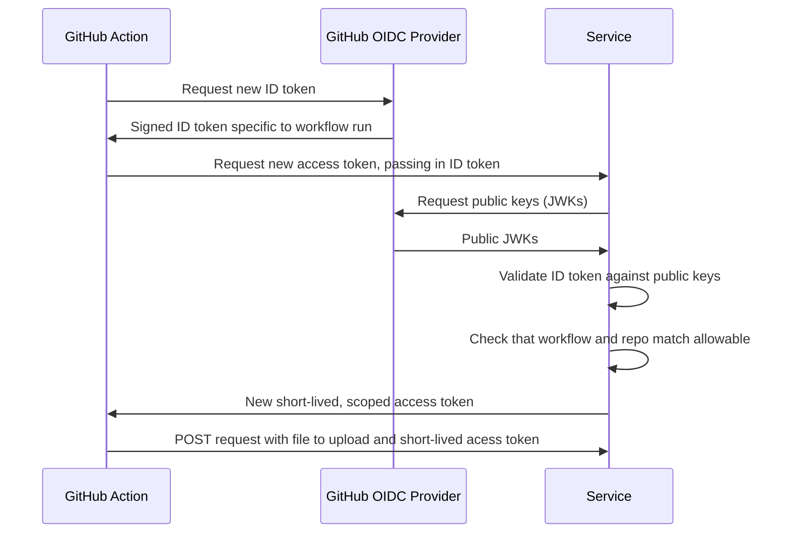

# Trusted Publishing POC

This repo contains a working proof-of-concept to demonstrate how "Trusted Publishing", as implemented by [PyPI](https://docs.pypi.org/trusted-publishers/), works.

In short, this repo demonstrates how GitHub Actions can be used as an OIDC provider to request a short-lived access token to upload a package, which removes the normal need to do manual token management.

The example provided in this repository has two parts:

1. A simple FastAPI application, which performs the OIDC token validation and granting of a dummy access token. This application is hard-coded to only grant tokens that are requested from a specific GitHub Actions workflow.
2. Two workflows which make a representative request to get a new access token: one is valid and the server will allow it to request an access token, while the other is invalid and will receive a 403 error when the request is made.

The application is deployed at: https://trusted-publishing-poc.fly.dev

## How it works

The following two links provide a majority of the details and give an overview of how GitHub implements this flow:

1. [About security hardening with OpenID Connect](https://docs.github.com/en/actions/security-for-github-actions/security-hardening-your-deployments/about-security-hardening-with-openid-connect#enabling-openid-connect-for-your-cloud-provider)
2. [Configuring OpenID Connect in cloud providers](https://docs.github.com/en/actions/security-for-github-actions/security-hardening-your-deployments/configuring-openid-connect-in-cloud-providers)

In our case, the FastAPI app represents the "Cloud Provider", while the workflows represent the user wanting to perform a package upload from a trusted publisher (GitHub).

### Sequence Diagram

The diagram below demonstrates the sequence of the token exchange/grant process.
All except the final upload are implemented in this POC.



### The FastAPI App

The FastAPI app is defined in `app.py`.
The dependencies are specified in `environment.yaml`, and the application is deployed using the `Dockerfile`.
We are using fly.io as a hosting provider, which uses the settings in `fly.toml`.
The application is continuously deployed using [this workflow file](./.github/workflows/deploy.yaml).

### The Publish Workflows

The GitHub Actions workflow in [./.github/workflows/publish-good.yaml](./.github/workflows/publish-good.yaml) requests the following permissions, which provides the workflow with an ID token.

```yaml
permissions:
  id-token: write # This is required for requesting the JWT
```

### The ID token

The ID token is a JWT, which contains information about the specific workflow that is being used.
When decoded, the JWT provides information like this:

```json
{
  "jti": "98a4a35f-51e9-482f-8503-1339366672b7",
  "sub": "repo:mattkram/trusted-publishing-poc:ref:refs/heads/main",
  "aud": "https://github.com/mattkram",
  "ref": "refs/heads/main",
  "sha": "d671a7f7a9e4f48e43e4b4e893d09d8d4d58d7f7",
  "repository": "mattkram/trusted-publishing-poc",
  "repository_owner": "mattkram",
  "repository_owner_id": "11037737",
  "run_id": "14677623447",
  "run_number": "10",
  "run_attempt": "3",
  "repository_visibility": "public",
  "repository_id": "972983987",
  "actor_id": "11037737",
  "actor": "mattkram",
  "workflow": "Publish",
  "head_ref": "",
  "base_ref": "",
  "event_name": "push",
  "ref_protected": "false",
  "ref_type": "branch",
  "workflow_ref": "mattkram/trusted-publishing-poc/.github/workflows/publish-good.yaml@refs/heads/main",
  "workflow_sha": "d671a7f7a9e4f48e43e4b4e893d09d8d4d58d7f7",
  "job_workflow_ref": "mattkram/trusted-publishing-poc/.github/workflows/publish-good.yaml@refs/heads/main",
  "job_workflow_sha": "d671a7f7a9e4f48e43e4b4e893d09d8d4d58d7f7",
  "runner_environment": "github-hosted",
  "iss": "https://token.actions.githubusercontent.com",
  "nbf": 1745640532,
  "exp": 1745641432,
  "iat": 1745641132
}
```

Note that the `"sub"` field contains the exact repository and branch, and the `"workflow_ref"` does as well, in addition to the exact name of the workflow file.
This JWT can be validated against the token issuer, which is provided in the `"iss"` field.
The public keys can be found by traversing the OIDC configuration hosted at https://token.actions.githubusercontent.com/.well-known/openid-configuration.

Once the key is validated, we know which workflow is being used.


### Requesting an access token

In the POC, the GitHub Actions workflow passes the ID token in as a bearer token in a request:

```shell
curl --fail https://trusted-publishing-poc.fly.dev/token -H "Authorization: Bearer $ID_TOKEN"
```

This request represents a common way one might request a new access token.

The endpoint will respond with the following, if the ID token is accepted.

```json
{"access_token": "super-secret-token"}
```

Or, it will return with a 403 or 401 response, if the token was missing, the ID token could not be verified, or the information in the ID token is not representative of a "good" workflow that is allowed to request a token.

### Server configuration

The service is hard-coded to grant tokens to the following workflow file only:

```python
ALLOWED_REPO = "mattkram/trusted-publishing-poc"
ALLOWED_BRANCH = "refs/heads/main"
ALLOWED_WORKFLOW = "publish-good.yaml"
```

In a real-world scenario, this would be configured by users, much like PyPI, and stored in a database.

## How you know it works

Thw [Actions runs](https://github.com/mattkram/trusted-publishing-poc/actions) show that the `publish-good.yaml` workflow is successful, while the `publish-bad.yaml` workflow fails.
